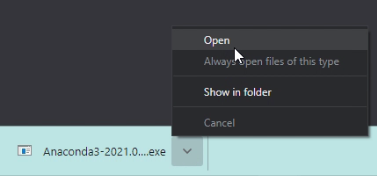

# OmicsOne
a tool kit for visualization and analysis of omics data

# Installation locally on Windows
Here is a step by step tutorial for install Anaconda 3 and run OmicsOne under conda environment.
You can also choose to install OmicsOne in any Python 3.6 environment without install Anaconda 3.
1. Download and install Anacoda 3 (https://www.anaconda.com/products/individual)

scroll down to the bottom of the front page

download the 64-bit version and install anaconda



Select folder you want to install

Add Anaconda 3 to PATH (optional)


Wait until it is completed


2. Install conda virtual environment for Python 3.6
Click Anaconda Prompt (anaconda3) to open the command line window

type 'conda create --name omicsone python=3.6' to install python 3.6 environment named as 'omicsone'

Select 'y' for 'Proceed ([y]/n)?' and wait until the Python 3.6 environment of OmicsOne is established.


3. Activate the Python 3.6 environment named as 'omicsone'
type 'conda activate omicsone' to activate Python 3.6 environment

4. Clone or download OmicsOne folder
5. Install python package dependencies using the requirements.txt in the root folder of Github repository of OmicsOne
```
$ pip install -r requirements.txt
```
3. Install OmicsOne pacakge in the dist/ folder
```
$ pip install omicsone-1.0-cp36-cp36m-win_amd64.whl
```
4. Download the "sample" and "script" folders to your working directory, open command line terminal in Windows and type:
```
$ jupyter notebook
```
6. Run "OmicsOne_test_all_win_amd64_local.ipynb" to test all packages. 
Please check all the paths in the test script and change them to your working directory

# Try without installation via mybinder.org (under testing)
click here [](https://mybinder.org/v2/gh/huizhanglab-jhu/OmicsOne/master) 
or paste the repo URL:https://github.com/huizhanglab-jhu/OmicsOne.git to https://gke.mybinder.org/ as below:


# Installation locally on Ubuntu (under testing)
1. Download and install Anacoda 3 (https://anaconda.org/)
2. Clone the OmicsDiscoverer repo to local computer
3. Install python package dependencies using the requirements.txt in the root folder
```
$ pip install -r requirements.txt
```
4. Start Jupyter notebook under the root folder of OmicsOne
```
$ jupyter notebook
```
You should see the root folder opened automatically in your default Web browser (e.g. Chrome or Firefox)


# Usage
1. Click OmicsDiscovererDemo.ipynb 

2. "Toggle Code" to show GUI part (optional)

3. Click Run to run the sample code

