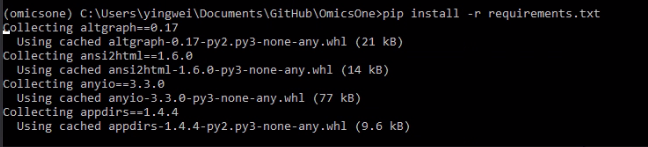
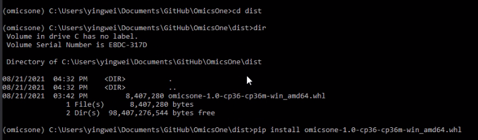

# OmicsOne
OmicsOne:  Associate Omics Data with Phenotypes in One-Click

# Installation locally on Windows
Here is a step by step tutorial for install Anaconda 3 and run OmicsOne under conda environment.
The video tutorial can be found in https://youtu.be/HOGLNm02qCk.
You can also choose to install OmicsOne in an existed Python 3.6 environment (Skip Step.1-4) without install Anaconda 3.
1. Download and install Anacoda 3 (https://www.anaconda.com/products/individual), and scroll down to the bottom of the front page <br>
<br>
<br>
<br>
<br>
Select folder you want to install <br>
<br>
Add Anaconda 3 to PATH (optional) <br>
<br>
<br>
Wait until it is completed <br>
<br>
<br>
2. Install conda virtual environment for Python 3.6
Click Anaconda Prompt (anaconda3) to open the command line window. <br>
 <br>
type 'conda create --name omicsone python=3.6' to install python 3.6 environment named as 'omicsone'<br>
 <br>
Select 'y' for 'Proceed ([y]/n)?' and wait until the Python 3.6 environment of OmicsOne is established.<br>
<br>
<br>
3. Clone or download OmicsOne folder in your local computer<br>
In this demo, the root folder path of OmicsOne is C:\Users\Yingwei\Documents\Github\OmicsOne<br>
<br>
4. Activate the Python 3.6 environment named as 'omicsone' and change directory to the root folder of OmicsOne.<br>
type 'conda activate omicsone' to activate Python 3.6 environment<br>
<br>
5. Install python package dependencies using the requirements.txt in the root folder of OmicsOne<br>
```
$ pip install -r requirements.txt
```
<br>
6. Change directory to the dist/ folder and install OmicsOne pacakge in the dist/ folder<br>
```
$ pip install omicsone-1.0-cp36-cp36m-win_amd64.whl
```
<br>
7. start OmicsOne server<br>
```
$ omicsone-runserver
```
<br>
8. OmicsOne will automatically start a new Window in your default web broswer, such as Chrome.
It will automatically run the sample data to show the demo. 
1) Input files: You can change the path in the input area to direct OmicsOne to run your own data. <br>
2) After validating the paths of input files and output directory, please check the 'Confirm Paths' to start the preprocessing <br>
3) Click 'run phenotype association analysis' button for the phenotype association analysis <br>
